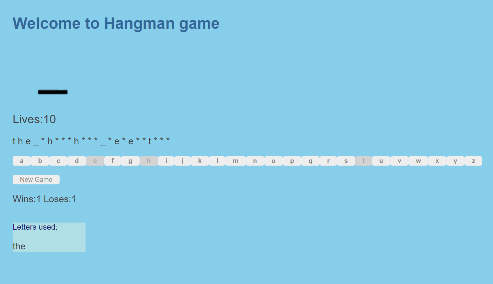

# Hangman
### Made using Angular 6.0.2 and NodeJS 8.9.4 With ExpressJS 4.16.3
### To run the project 
- Download repository or git clone.
- Go to the project root folder then open a command prompt / Terminal and run 'npm install' *
- run 'npm start' in the terminal

*NodeJS must be installed to run 'npm install', you can find it <a href='https://nodejs.org/en/'>here</a>

## Project Structure Details:
- bin/www : The file called when you use 'npm start', this create the server on the specified port.
- app.js: Where the routers / Error paths are defined.
- src/app: Contains the angular component, its CSS, Classes, Angular Routing,Component Template and Module (Change these files to change              front end)
- model/movie.js : Contains our movie model for hangman
- routes/movieroutes.js : Restful API calls defined here

